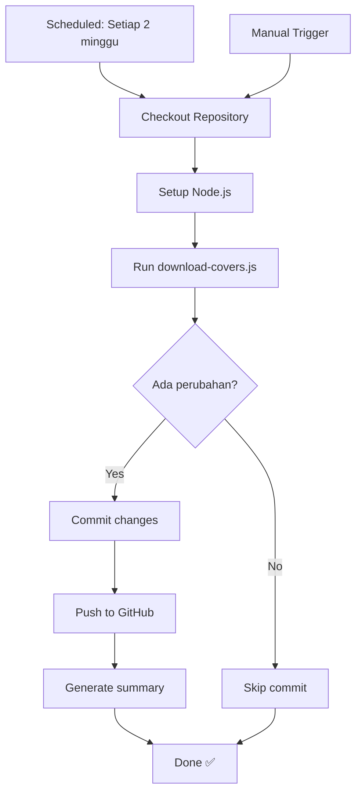

# 🎯 GitHub Actions Auto Cover Update - Summary

## 📊 Gambaran Lengkap Solusi

### Sebelum (Manual):
```
❌ Harus ingat kapan update
❌ Run script manual: node download-covers.js
❌ Commit & push manual
❌ Butuh PC/laptop online
```

### Sesudah (Automated):
```
✅ Otomatis setiap 2 minggu
✅ Berjalan di cloud (GitHub)
✅ Commit & push otomatis
✅ Bisa trigger manual kapan saja
✅ Gratis (untuk public repo)
```

## 🗂️ File yang Diberikan

### 1. `.github/workflows/update-covers.yml`
**Fungsi**: Workflow GitHub Actions utama  
**Isi**:
- Scheduled run setiap 14 hari
- Setup Node.js environment
- Run download-covers.js
- Auto commit & push changes
- Generate update summary

**Jadwal**: Minggu, 00:00 UTC (setiap 2 minggu)

### 2. `GITHUB_ACTIONS_README.md`
**Fungsi**: Dokumentasi lengkap dan detail  
**Isi**:
- Penjelasan cara kerja workflow
- Setup instructions
- Monitoring & logs
- Kustomisasi jadwal
- Troubleshooting guide
- Security notes

### 3. `QUICK_REFERENCE.md`
**Fungsi**: Panduan cepat & ringkas  
**Isi**:
- Setup cepat (copy-paste commands)
- Troubleshooting table
- Cron schedule reference
- Git commands cheat sheet
- Links berguna

### 4. `SETUP_CHECKLIST.md`
**Fungsi**: Checklist step-by-step  
**Isi**:
- Pre-setup requirements
- Step-by-step setup guide
- Verification checklist
- Troubleshooting common issues

### 5. `cleanup.sh`
**Fungsi**: Script untuk hapus file manual  
**Isi**:
- Hapus force-update-covers.js
- Hapus Command_Buat_Download_Cover
- Hapus backup files
- Konfirmasi sebelum delete

### 6. `.gitignore`
**Fungsi**: Exclude file tidak perlu dari Git  
**Isi**:
- Backup files (*.backup)
- OS files (.DS_Store)
- Editor configs
- Node modules (jika ada)

## 📋 Langkah Setup Singkat

```bash
# 1. Copy semua file ke repository
cp -r .github/ /path/to/your/repo/
cp .gitignore /path/to/your/repo/

# 2. Cleanup file manual (opsional)
bash cleanup.sh

# 3. Commit & push
git add .github/ .gitignore
git commit -m "🤖 Setup GitHub Actions"
git push

# 4. Enable di GitHub
# Settings → Actions → Enable & set "Read and write permissions"

# 5. Test manual trigger
# Actions tab → Run workflow
```

## 🎯 File yang Bisa Dihapus dari Repo

Setelah setup GitHub Actions, file-file ini **tidak diperlukan lagi**:

| File | Alasan Dihapus |
|------|----------------|
| `force-update-covers.js` | Diganti dengan manual trigger di GitHub Actions |
| `Command_Buat_Download_Cover` | Tidak perlu run manual lagi |
| `script_js.force-backup` | Backup handled by Git history |
| `script.js.backup` | Same as above |

Gunakan `cleanup.sh` untuk hapus otomatis:
```bash
bash cleanup.sh
```

## 🔄 Workflow Process Flow



## 📊 Benefit Analysis

### Waktu yang Dihemat:
| Task | Manual | Automated |
|------|--------|-----------|
| Update cover | 10-15 menit | 0 menit |
| Commit & push | 2-3 menit | 0 menit |
| Ingat jadwal | Mental load | 0 menit |
| **Total per update** | **~15 menit** | **0 menit** |
| **Per tahun (26x)** | **~6.5 jam** | **0 jam** |

### Resource yang Dihemat:
- ✅ Tidak perlu PC/laptop online
- ✅ Tidak perlu install Node.js lokal
- ✅ Tidak perlu ingat jadwal update
- ✅ Tidak ada maintenance script manual

### Reliability:
- ✅ Tidak terpengaruh lupa atau sibuk
- ✅ Konsisten setiap 2 minggu
- ✅ Auto-retry jika error
- ✅ Logs tersimpan untuk audit

## 🔐 Security & Privacy

### Yang Aman:
- ✅ Hanya akses data public MangaDex API
- ✅ Tidak ada credentials/API key
- ✅ Hanya update file di repo sendiri
- ✅ GitHub Actions environment isolated

### Permissions Dibutuhkan:
- Read: Untuk checkout repository
- Write: Untuk commit & push changes
- Actions: Untuk run workflow

## 📈 Monitoring & Maintenance

### Auto Monitoring:
- Workflow runs history di Actions tab
- Email notification jika workflow fail
- Commit history dari github-actions[bot]

### Manual Checks (Opsional):
```bash
# Cek workflow runs
gh run list --workflow=update-covers.yml

# Cek latest run logs
gh run view

# Cek commits dari bot
git log --author="github-actions[bot]"
```

### Maintenance Required:
- **Minimal**: Tidak perlu maintenance rutin
- **Jika error**: Cek logs di Actions, fix jika perlu
- **Ubah jadwal**: Edit workflow file jika mau

## 🎓 Best Practices

1. **Test First**: Trigger manual setelah setup untuk test
2. **Monitor Initial Runs**: Pantau 2-3 run pertama
3. **Keep Docs Updated**: Update README jika ada perubahan
4. **Backup Script**: Keep `download-covers.js` clean
5. **Check Rate Limits**: MangaDex API punya limits

## 🆘 Common Issues & Solutions

| Issue | Solution |
|-------|----------|
| Workflow tidak run | Enable Actions di Settings |
| Permission denied | Set "Read and write permissions" |
| Rate limit MangaDex | Auto-retry, tunggu beberapa jam |
| Node.js error | Update script compatibility |
| Cover tidak berubah | Normal, cover sudah terbaru |

## 📚 Additional Resources

- **GitHub Actions Docs**: https://docs.github.com/actions
- **Cron Expression Helper**: https://crontab.guru/
- **MangaDex API Docs**: https://api.mangadex.org/docs/
- **Node.js HTTPS Module**: https://nodejs.org/api/https.html

## 🎉 Conclusion

Dengan GitHub Actions setup ini:
- ✅ Tidak perlu run script manual lagi
- ✅ Hemat waktu ~6.5 jam per tahun
- ✅ Lebih reliable & konsisten
- ✅ Full automation, zero maintenance
- ✅ Gratis untuk public repository

**Next Steps**:
1. Follow `SETUP_CHECKLIST.md`
2. Test dengan manual trigger
3. Monitor first few runs
4. Enjoy automation! 🚀

---

**Created**: 2025-01-24  
**Version**: 1.0.0  
**License**: Free to use & modify
